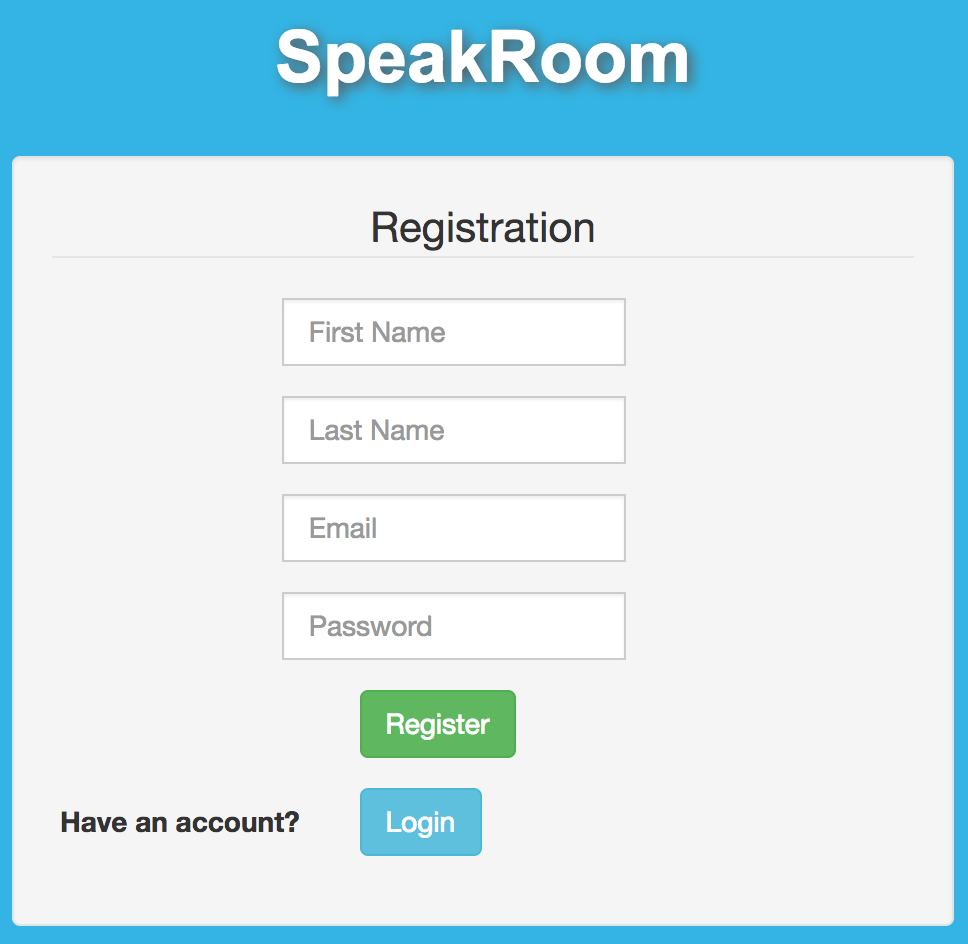
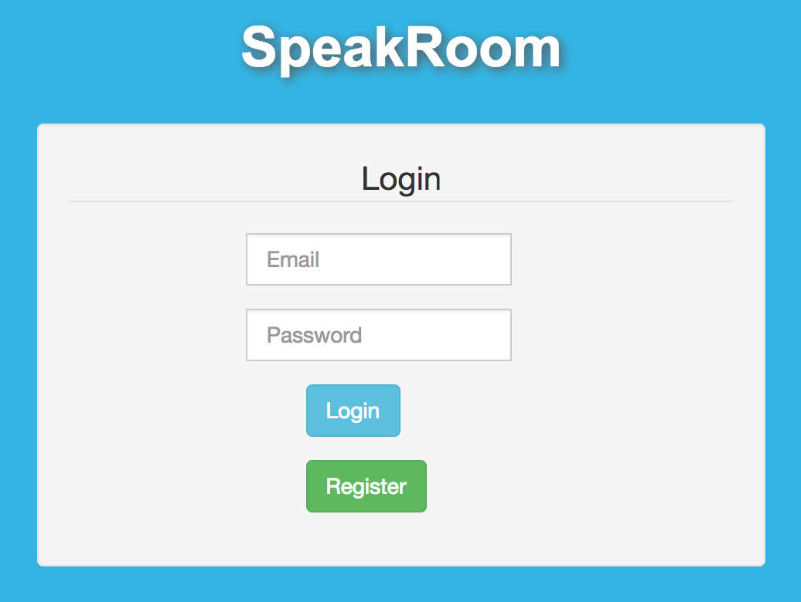
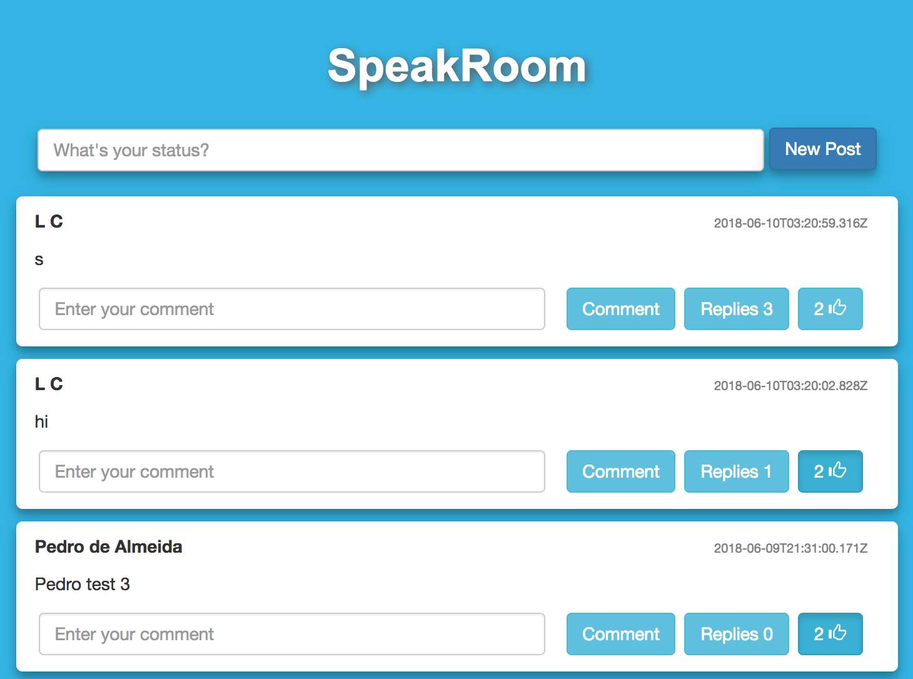
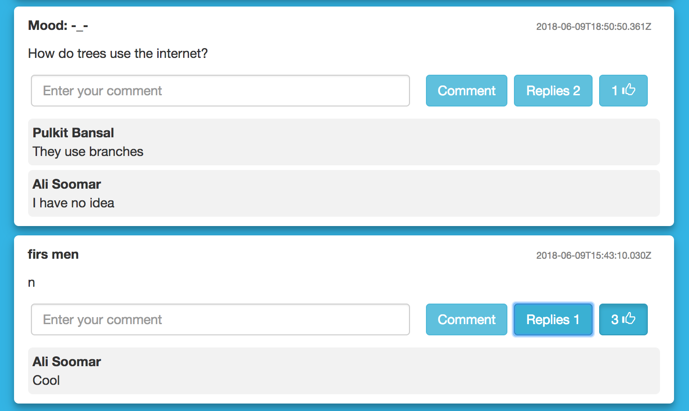

# speakroom
Speakroom is a basic social media platform that allows you to share your thoughts with others. After registering, you can log in and view others' posts. You can also comment, like or create your own posts as well!

**Tools**

Speakroom was built with the use of HTML, CSS, JavaScript, Bootstrap, jQuery, and AJAX.

## Speakroom v1.0
This first version allows basic functionality of the page with a rudimentary design that was made using Bootstrap.

